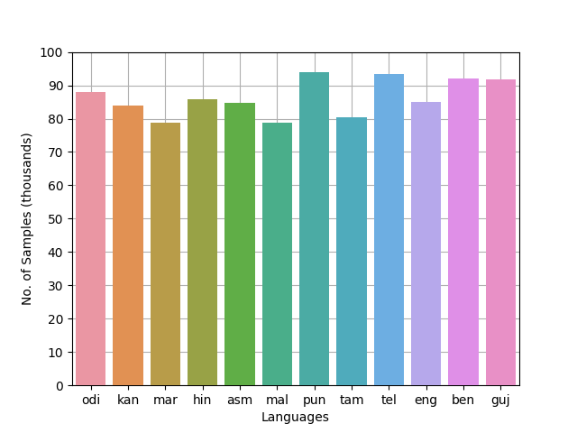
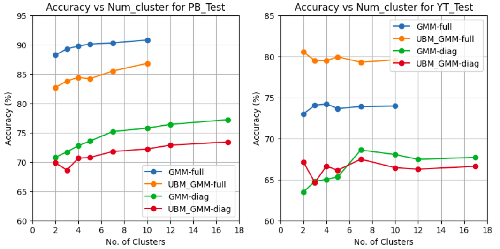

# Indian-spoken-language-classifier
[](https://colab.research.google.com/github/Narayan1281/Indian-Spoken-Language-Classifier/blob/main/sound_classifier.ipynb)


The goal here is to perform spoken language identification (LID) experiments using machine learning techniques such as GMM and UBM-GMM and develop a language identification (LID) system.

## Dataset Information:

We'll be working on [IIT Mandi LID dataset](https://speechiitmandi.github.io/air/). The languages in the dataset are: Assamese, Gujarati, Kannada, Malayalam, Bengali, Hindi, Odia and Telugu. Their contributions in training dataset are as follows.



No. of samples in Prasar Bharti Training, Test and youtube test datasets are as follows:
```
+------------+-----------+-----------+
|   Pb_Train |   Pb_Test |   Yt_Test |
+============+===========+===========+
|  1,036,801 |   519,095 |  458,388  |
+------------+-----------+-----------+
```

## Results and Discussion:

- **Comparision of performance of both type of models**


- From above plots we can say that the ```Universal Background model``` gives better performance results on Yt_test whereas ```GMM``` has more accuracy (best 90%) on Pb_Test.

- Moreover the performance of both type of model is better if we use full covariance matrix. There is a difference of almost 15% in accuracies. 
  
- However, model (either GMM or UBM-GMM) trained with full covariance matrix in computationally heavy, both during training and prediction scenarios. So, we need to keep this trade-off in mind.
  
- **Confusion Matrix for best model configurations**
  * UBM-GMM: full covariance, 2 clusters, Yt_test
  _pb.png)
  
  * GMM: full covariance, 10 clusters, Pb_test
  _pb.png)

- Obeserving above confusion matrices we can see that higher percentage of ```Punjabi``` language has been misclassified as ```Hindi``` and ```Gujrati```, in case of Pb_Test wheras in case of Yt_test a large portion of ```Marathi``` is misclassified as ```Punjabi``` and ```Telugu```. 

- Therefore, we could infer that ```Punjabi```, ```Hindi``` and ```Gujrati``` are confusable languages to our model. Also, ```Marathi``` is confusable with ```Punjabi``` and ```Telugu``` based on Yt_test.

## Future Aspects

- Implementation of GMM (from scratch) using tensorflow-gpu so that training time can be minimised.

-  Using ```Neural Network based model``` to perform classification task for better accuracies.

## Details about LID Dataset

>  The original dataset contains audios as **.wav** format. 39-dimensional (d = 39) Mel
frequency cepstral coefficients (MFCCs) are used as the feature representation. These MFCC features are of varying length (depending on the duration
of the speech utterance from which they were derived). This is achieved by
using a voice activity detector algorithm (which itself is based on a GMM).

Here, in this project we have used **preprocessed/(csv) dataset**. 

