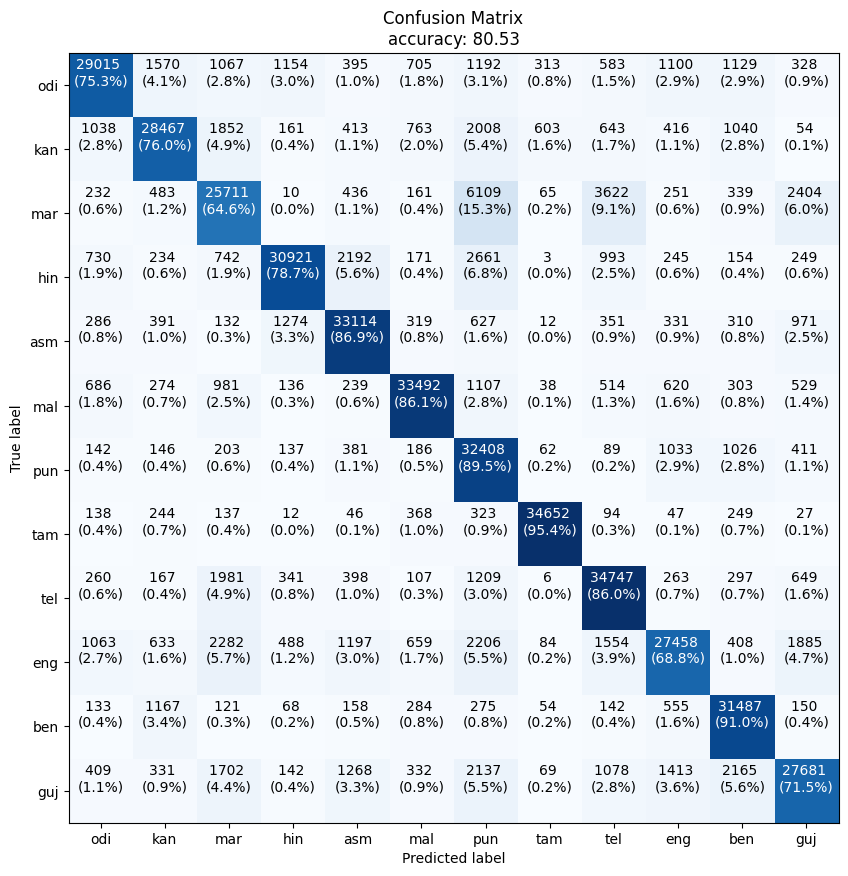
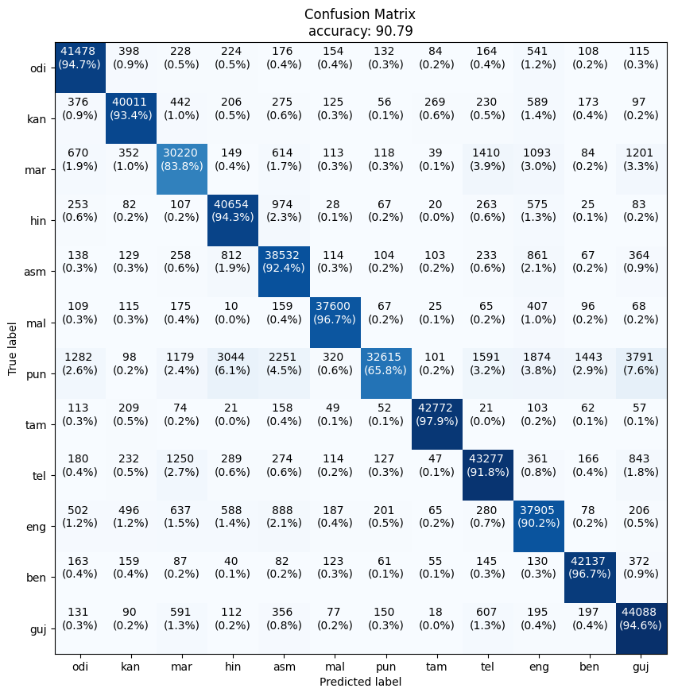

# Indian-spoken-language-classifier

The goal here is to perform spoken language identification (LID) experiments using machine learning techniques such as GMM and UBM-GMM. 

## Dataset Information:

We'll be working on [IIT Mandi LID dataset](https://speechiitmandi.github.io/air/). The languages in the dataset are: Assamese, Gujarati, Kannada, Malayalam, Bengali, Hindi, Odia and Telugu. Their contributions in training dataset are as follows.


No. of samples in Prasar Bharti Training, Test and youtube test datasets are as follows:
```
+------------+-----------+-----------+
|   Pb_Train |   Pb_Test |   Yt_Test |
+============+===========+===========+
|  1,036,801 |   519,095 |  458,388  |
+------------+-----------+-----------+
```

## Results and Discussion:

- **Comparision of performance of both type of models**


- From above plots we can say that the ```Universal Background model``` gives better performance results on Yt_test whereas ```GMM``` has more accuracy (best 90%) on Pb_Test.

- Moreover the performance of both type of model is better if we use full covariance matrix. There is a difference of almost 15% in accuracies. 
  
- However, model (either GMM or UBM-GMM) trained with full covariance matrix in computationally heavy, both during training and prediction scenarios. So, we need to keep this trade-off in mind.
  
- **Confusion Matrix for best model configurations**
  * UBM-GMM: full covariance, 2 clusters, Yt_test
  

  * GMM: full covariance, 10 clusters, Pb_test
    


